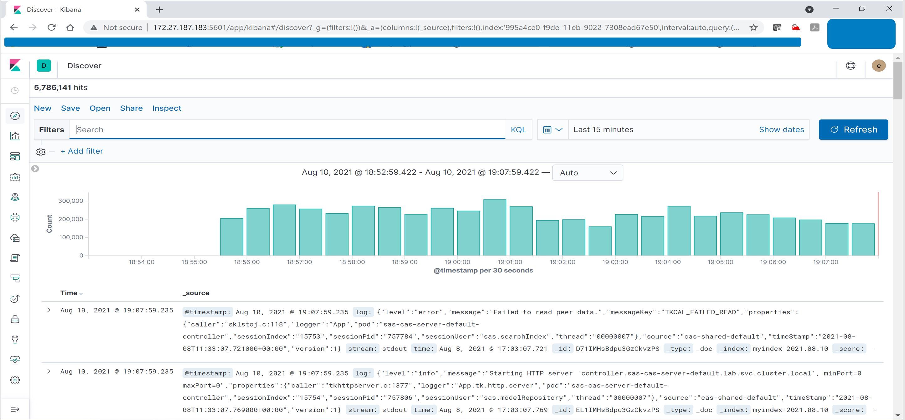

# Logging-Elasticsearch-Fluentd-Kibana

## Deployment of Elastiscearch, Fluentd and Kibana for SAS Viya 4 Logging

### Setup comman namespace for all

```
# kubectl create ns kube-logging

```

### Setup Elastic Search - Creating the Elasticsearch StatefulSet

#### Creating the Headless Service

```
# vi elasticsearch_headless_svc.yaml
kind: Service
apiVersion: v1
metadata:
  name: elasticsearch
  namespace: kube-logging
  labels:
    app: elasticsearch
spec:
  selector:
    app: elasticsearch
  clusterIP: None
  ports:
    - port: 9200
      name: rest
    - port: 9300
      name: inter-node

# kubectl create -f elasticsearch_headless_svc.yaml
# kubectl get services --namespace=kube-logging
```

#### Creating the StatefulSet

```
# vi elasticsearch_statefulset.yaml
apiVersion: apps/v1
kind: StatefulSet
metadata:
  name: es-cluster
  namespace: kube-logging
spec:
  serviceName: elasticsearch
  replicas: 3
  selector:
    matchLabels:
      app: elasticsearch
  template:
    metadata:
      labels:
        app: elasticsearch
    spec:
      containers:
      - name: elasticsearch
        image: docker.elastic.co/elasticsearch/elasticsearch:7.2.0
        resources:
            limits:
              cpu: 1000m
            requests:
              cpu: 100m
        ports:
        - containerPort: 9200
          name: rest
          protocol: TCP
        - containerPort: 9300
          name: inter-node
          protocol: TCP
        volumeMounts:
        - name: data
          mountPath: /usr/share/elasticsearch/data
        env:
          - name: cluster.name
            value: k8s-logs
          - name: node.name
            valueFrom:
              fieldRef:
                fieldPath: metadata.name
          - name: discovery.seed_hosts
            value: "	,es-cluster-1.elasticsearch,es-cluster-2.elasticsearch"
          - name: cluster.initial_master_nodes
            value: "es-cluster-0,es-cluster-1,es-cluster-2"
          - name: ES_JAVA_OPTS
            value: "-Xms2048m -Xmx2048m"
      initContainers:
      - name: fix-permissions
        image: busybox
        command: ["sh", "-c", "chown -R 1000:1000 /usr/share/elasticsearch/data"]
        securityContext:
          privileged: true
        volumeMounts:
        - name: data
          mountPath: /usr/share/elasticsearch/data
      - name: increase-vm-max-map
        image: busybox
        command: ["sysctl", "-w", "vm.max_map_count=262144"]
        securityContext:
          privileged: true
      - name: increase-fd-ulimit
        image: busybox
        command: ["sh", "-c", "ulimit -n 65536"]
        securityContext:
          privileged: true
  volumeClaimTemplates:
  - metadata:
      name: data
      labels:
        app: elasticsearch
    spec:
      accessModes: [ "ReadWriteOnce" ]
      storageClassName: nfs-client
      resources:
        requests:
          storage: 100Gi
		  
Note: change the storage class (default - do-block-storage) to the actual one you have defined in your kube cluster. in my case it is nfs-client

# kubectl create -f elasticsearch_statefulset.yaml

# kubectl rollout status sts/es-cluster --namespace=kube-logging
Waiting for 3 pods to be ready...
Waiting for 2 pods to be ready...
Waiting for 1 pods to be ready...
partitioned roll out complete: 3 new pods have been updated...
# kubectl get pod -n kube-logging -o wide
NAME           READY   STATUS    RESTARTS   AGE     IP              NODE                     NOMINATED NODE   READINESS GATES
es-cluster-0   1/1     Running   0          6m      10.244.73.108   mumcnslnx05.in.sas.com   <none>           <none>
es-cluster-1   1/1     Running   0          4m28s   10.244.69.12    mumcnslnx03.in.sas.com   <none>           <none>
es-cluster-2   1/1     Running   0          3m7s    10.244.73.31    mumcnslnx02.in.sas.com   <none>           <none>

# kubectl port-forward --address 0.0.0.0 es-cluster-0 9200:9200 --namespace=kube-logging
Tetsing
--------
# curl http://localhost:9200/_cluster/state?pretty
# curl http://localhost:9200/_nodes/transport?pretty
```

### Creating the Kibana Deployment and Service
```
# vi kibana.yaml
apiVersion: v1
kind: Service
metadata:
  name: kibana
  namespace: kube-logging
  labels:
    app: kibana
spec:
  ports:
  - port: 5601
  selector:
    app: kibana
---
apiVersion: apps/v1
kind: Deployment
metadata:
  name: kibana
  namespace: kube-logging
  labels:
    app: kibana
spec:
  replicas: 1
  selector:
    matchLabels:
      app: kibana
  template:
    metadata:
      labels:
        app: kibana
    spec:
      containers:
      - name: kibana
        image: docker.elastic.co/kibana/kibana:7.2.0
        resources:
          limits:
            cpu: 1000m
          requests:
            cpu: 100m
        env:
          - name: ELASTICSEARCH_URL
            value: http://mumcnslnx01.in.sas.com:9200
        ports:
        - containerPort: 5601
# kubectl create -f kibana.yaml
# kubectl rollout status deployment/kibana --namespace=kube-logging
Waiting for deployment "kibana" rollout to finish: 0 of 1 updated replicas are available...
deployment "kibana" successfully rolled out
# kubectl get pods --namespace=kube-logging
NAME                      READY   STATUS    RESTARTS   AGE
es-cluster-0              1/1     Running   0          34m
es-cluster-1              1/1     Running   0          34m
es-cluster-2              1/1     Running   0          33m
kibana-5749b5778b-cnkxb   1/1     Running   0          97s
# kubectl port-forward --address 0.0.0.0 kibana-5749b5778b-cnkxb 5601:5601 --namespace=kube-logging
URL: http://localhost:5601
http://mumcnslnx01.in.sas.com:5601
https://172.27.187.183:5601

```

#### Creating the Fluentd DaemonSet

```
# vi fluentd.yaml
apiVersion: v1
kind: ServiceAccount
metadata:
  name: fluentd
  namespace: kube-logging
  labels:
    app: fluentd
---
apiVersion: rbac.authorization.k8s.io/v1
kind: ClusterRole
metadata:
  name: fluentd
  labels:
    app: fluentd
rules:
- apiGroups:
  - ""
  resources:
  - pods
  - namespaces
  verbs:
  - get
  - list
  - watch
---
kind: ClusterRoleBinding
apiVersion: rbac.authorization.k8s.io/v1
metadata:
  name: fluentd
roleRef:
  kind: ClusterRole
  name: fluentd
  apiGroup: rbac.authorization.k8s.io
subjects:
- kind: ServiceAccount
  name: fluentd
  namespace: kube-logging
---
apiVersion: apps/v1
kind: DaemonSet
metadata:
  name: fluentd
  namespace: kube-logging
  labels:
    app: fluentd
spec:
  selector:
    matchLabels:
      app: fluentd
  template:
    metadata:
      labels:
        app: fluentd
    spec:
      serviceAccount: fluentd
      serviceAccountName: fluentd
      tolerations:
      - key: node-role.kubernetes.io/master
        effect: NoSchedule
      containers:
      - name: fluentd
        image: fluent/fluentd-kubernetes-daemonset:v1.4.2-debian-elasticsearch-1.1
        env:
          - name:  FLUENT_ELASTICSEARCH_HOST
            value: "elasticsearch.kube-logging.svc.cluster.local"
          - name:  FLUENT_ELASTICSEARCH_PORT
            value: "9200"
          - name: FLUENT_ELASTICSEARCH_SCHEME
            value: "http"
          - name: FLUENTD_SYSTEMD_CONF
            value: disable
        resources:
          limits:
            memory: 512Mi
          requests:
            cpu: 100m
            memory: 200Mi
        volumeMounts:
        - name: varlog
          mountPath: /var/log
        - name: varlibdockercontainers
          mountPath: /var/lib/docker/containers
          readOnly: true
      terminationGracePeriodSeconds: 30
      volumes:
      - name: varlog
        hostPath:
          path: /var/log
      - name: varlibdockercontainers
        hostPath:
          path: /var/lib/docker/containers
# kubectl create -f fluentd.yaml
# kubectl get ds --namespace=kube-logging
NAME      DESIRED   CURRENT   READY   UP-TO-DATE   AVAILABLE   NODE SELECTOR   AGE
fluentd   4         4         4       4            4           <none>          73s
```

#### Remove/Clean elasticsearch, fluentd and kibana deployment

```
kubectl -n kube-logging delete svc elasticsearch
kubectl -n kube-logging delete statefulsets es-cluster
kubectl -n kube-logging delete DaemonSet fluentd
kubectl -n kube-logging delete clusterrole fluentd
kubectl -n kube-logging delete clusterrolebinding fluentd
kubectl -n kube-logging delete svc kibana
kubectl -n kube-logging delete Deployment kibana
kubectl delete ns kube-logging
```


